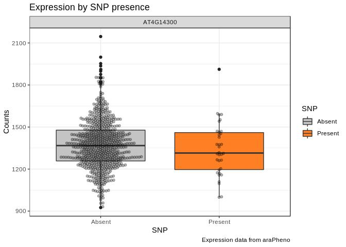

About gwaR
================

# gwaR

A collection of R functions to conduct downstream GWAS analysis for
Arabidopsis thaliana.

# About

This package provides functions for fast analysis of GWAS tables. This
package interacts with the 1001genomes API for variant tables by
default, but can also deal with local SNPmatrix (needs to be fst
format). Annotations are fetched from biomart upon package installation,
and should be TAIR10. The overall idea is to be able to have a package
that integrates tasks that are usually carried out by visiting different
websites and trying to collect and curate information. This package
provides no new classes, but the table containing the SNP information
(chromosome, position, pvalue) needs to conform to the expectations.
There are wrappers that import csv files to match the desired format.
This package is pipe-friendly.

# Installation

``` r
devtools::install_github("Gregor-Mendel-Institute/gwaR")
library(gwaR)
```

# Examples

The examples here use data generated by [aradeepopsis](https://github.com/Gregor-Mendel-Institute/aradeepopsis)

## Data in


Other packages needed here:

``` r
library(tidyverse)
library(magrittr)
```
Download the 1001 genomes SNPmatrix if needed. This file is ~2.5
gb.

``` r
downloader::download("https://www.dropbox.com/s/edl0vk1xj26o02p/SNPmatrix_full.fst?dl=1", destfile = "SNPmatrix.fst")
SNPmatrix <- fst::fst("SNPmatrix.fst")
```

Load trait information

``` r
image_data <- vroom::vroom("aradeepopsis_traits.csv") %>% 
  dplyr::mutate(file_name = paste(file,format,sep =".")) %>% 
  dplyr::select(-file,-format)
```

``` r
image_data %>%
  head()
```

    ## # A tibble: 6 x 44
    ##   background_area background_red_… background_red_… background_gree…
    ##             <dbl>            <dbl>            <dbl>            <dbl>
    ## 1          262438             71.2               67             62.6
    ## 2          248055             77.9               68             65.5
    ## 3          265357             69.6               63             53.6
    ## 4          249190             81.6               76             65.9
    ## 5          195891             50.7               45             52.3
    ## 6          256664             69.0               65             62.1
    ## # … with 40 more variables: background_green_channel_median <dbl>,
    ## #   background_blue_channel_mean <dbl>,
    ## #   background_blue_channel_median <dbl>, rosette_area <dbl>,
    ## #   rosette_red_channel_mean <dbl>, rosette_red_channel_median <dbl>,
    ## #   rosette_green_channel_mean <dbl>, rosette_green_channel_median <dbl>,
    ## #   rosette_blue_channel_mean <dbl>, rosette_blue_channel_median <dbl>,
    ## #   senescent_area <dbl>, senescent_red_channel_mean <dbl>,
    ## #   senescent_red_channel_median <dbl>,
    ## #   senescent_green_channel_mean <dbl>,
    ## #   senescent_green_channel_median <dbl>,
    ## #   senescent_blue_channel_mean <dbl>,
    ## #   senescent_blue_channel_median <dbl>, anthocyanin_area <dbl>,
    ## #   anthocyanin_red_channel_mean <dbl>,
    ## #   anthocyanin_red_channel_median <dbl>,
    ## #   anthocyanin_green_channel_mean <dbl>,
    ## #   anthocyanin_green_channel_median <dbl>,
    ## #   anthocyanin_blue_channel_mean <dbl>,
    ## #   anthocyanin_blue_channel_median <dbl>,
    ## #   plant_region_red_channel_mean <dbl>,
    ## #   plant_region_red_channel_median <dbl>,
    ## #   plant_region_green_channel_mean <dbl>,
    ## #   plant_region_green_channel_median <dbl>,
    ## #   plant_region_blue_channel_mean <dbl>,
    ## #   plant_region_blue_channel_median <dbl>, filled_area <dbl>,
    ## #   convex_area <dbl>, equivalent_diameter <dbl>, major_axis_length <dbl>,
    ## #   minor_axis_length <dbl>, perimeter <dbl>, eccentricity <dbl>,
    ## #   extent <dbl>, solidity <dbl>, file_name <chr>

Load image metadata

``` r
metadata <- vroom::vroom("metadata.csv")
```

``` r
metadata %>% 
  head()
```

    ## # A tibble: 6 x 7
    ##      ID ACC_ID file_name date                date_day   hrs_since_start
    ##   <dbl>  <dbl> <chr>     <dttm>              <date>               <dbl>
    ## 1 18300   7411 18300_-_… 2018-10-01 20:04:00 2018-10-01             188
    ## 2 18300   7411 18300_-_… 2018-10-02 06:04:00 2018-10-02             198
    ## 3 18300   7411 18300_-_… 2018-10-02 20:04:00 2018-10-02             212
    ## 4 18300   7411 18300_-_… 2018-10-03 06:04:00 2018-10-03             222
    ## 5 18300   7411 18300_-_… 2018-10-03 20:04:00 2018-10-03             236
    ## 6 18300   7411 18300_-_… 2018-10-04 06:04:00 2018-10-04             246
    ## # … with 1 more variable: days_since_start <dbl>


## Manhattan plot

Read the output from a
gwas.

``` r
gwas_pvals <- read_limix("mac5_rel_senescent_2018-10-15_singletrait_pvals.csv")
```

    ## Rows: 2,712,080
    ## Columns: 5
    ## Delimiter: ","
    ## dbl [5]: chrom, pos, pv, maf, mac
    ## 
    ## Use `spec()` to retrieve the guessed column specification
    ## Pass a specification to the `col_types` argument to quiet this message

Plot a manhattan plot with annotations of overlapping genes for the top5 hits  (the default)

``` r
gwas_pvals %>%
  plot_gwas("Top 5 peaks")
```

<!-- -->

## SNP information

A straightforward way to tabulate the gene that is nearest to each of
the top 10 SNPs

``` r
gwas_pvals %>% 
  get_nearest_genes(10)
```

    ## # A tibble: 10 x 11
    ##    SNP_rank chrom    pos Significant log10_p   mac GeneId description
    ##    <chr>    <dbl>  <dbl> <chr>         <dbl> <dbl> <chr>  <chr>      
    ##  1 1            4 8.30e6 Bonferroni     19.2     8 AT4G1… Protein AC…
    ##  2 2            4 8.30e6 Bonferroni     17.9     9 AT4G1… AT4g14420/…
    ##  3 3            4 8.30e6 Bonferroni     17.9     9 AT4G1… AT4g14420/…
    ##  4 4            4 8.31e6 Bonferroni     17.9     9 AT4G1… Enoyl-CoA …
    ##  5 5            4 8.31e6 Bonferroni     17.9     9 AT4G1… Enoyl-CoA …
    ##  6 6            4 8.31e6 Bonferroni     17.9     9 AT4G1… Enoyl-CoA …
    ##  7 7            4 8.31e6 Bonferroni     17.9     9 AT4G1… Enoyl-CoA …
    ##  8 8            4 8.31e6 Bonferroni     17.9     9 AT4G1… Enoyl-CoA …
    ##  9 9            4 8.31e6 Bonferroni     17.2     9 AT4G1… Enoyl-CoA …
    ## 10 10           4 8.31e6 Bonferroni     17.2     9 AT4G1… Enoyl-CoA …
    ## # … with 3 more variables: transcript_biotype <chr>, start_position <int>,
    ## #   end_position <int>

Sometimes we only want to look at those that actually overlap (are in
coding regions)

``` r
gwas_pvals %>% 
  get_overlapping_genes(10) # Only returns overlaps
```

    ## # A tibble: 5 x 12
    ##   SNP_rank chrom    pos Significant log10_p   mac GeneId max_distance
    ##   <chr>    <dbl>  <dbl> <chr>         <dbl> <dbl> <chr>         <dbl>
    ## 1 1            4 8.30e6 Bonferroni     19.2     8 AT4G1…           -1
    ## 2 2            4 8.30e6 Bonferroni     17.9     9 AT4G1…           -1
    ## 3 3            4 8.30e6 Bonferroni     17.9     9 AT4G1…           -1
    ## 4 7            4 8.31e6 Bonferroni     17.9     9 AT4G1…           -1
    ## 5 8            4 8.31e6 Bonferroni     17.9     9 AT4G1…           -1
    ## # … with 4 more variables: description <chr>, transcript_biotype <chr>,
    ## #   start_position <int>, end_position <int>

In other times, we may want to quickly check if a gene is an interesting
candidate.

``` r
mine_gene("AT4G14400")
```

    ## $functions
    ## # A tibble: 6 x 5
    ##   Identifier Symbol Annotation                 Title                  PMID 
    ##   <chr>      <chr>  <chr>                      <chr>                  <chr>
    ## 1 AT4G14400  ACD6   Study propose that alleli… Modulation of ACD6 de… 3023…
    ## 2 AT4G14400  ACD6   NLR gene can mask the act… Modulation of ACD6 de… 3023…
    ## 3 AT4G14400  ACD6   Data indicate protein kin… Salicylic acid regula… 2531…
    ## 4 AT4G14400  ACD6   Salicylic acid signaling … Salicylic acid signal… 2492…
    ## 5 AT4G14400  ACD6   Here we show instead that… Activation of the Ara… 2501…
    ## 6 AT4G14400  ACD6   The effects of mutation o… Structure-function an… 1629…
    ## 
    ## $publications
    ## # A tibble: 24 x 4
    ##    Identifier Symbol Title                                           PMID  
    ##    <chr>      <chr>  <chr>                                           <chr> 
    ##  1 AT4G14400  ACD6   Modulation of ACD6 dependent hyperimmunity by … 30235…
    ##  2 AT4G14400  ACD6   Araport11: a complete reannotation of the Arab… 27862…
    ##  3 AT4G14400  ACD6   Accumulation of endogenous salicylic acid conf… 24603…
    ##  4 AT4G14400  ACD6   Salicylic acid signaling controls the maturati… 24923…
    ##  5 AT4G14400  ACD6   Activation of the Arabidopsis thaliana immune … 25010…
    ##  6 AT4G14400  ACD6   Salicylic acid regulates Arabidopsis microbial… 25315…
    ##  7 AT4G14400  ACD6   A survey of dominant mutations in Arabidopsis … 22995…
    ##  8 AT4G14400  ACD6   C2-mediated decrease in DNA methylation, accum… 23176…
    ##  9 AT4G14400  ACD6   Phylogenetic-based propagation of functional a… 21873…
    ## 10 AT4G14400  ACD6   SIZ1, a small ubiquitin-related modifier ligas… 19959…
    ## # … with 14 more rows
    ## 
    ## $`GO-Term Keywords`
    ## # A tibble: 0 x 0

Alternative:

``` r
gwas_pvals %>% 
  get_overlapping_genes(1) %$%
  GeneId %>% 
  mine_gene()
```

    ## $functions
    ## # A tibble: 6 x 5
    ##   Identifier Symbol Annotation                 Title                  PMID 
    ##   <chr>      <chr>  <chr>                      <chr>                  <chr>
    ## 1 AT4G14400  ACD6   Study propose that alleli… Modulation of ACD6 de… 3023…
    ## 2 AT4G14400  ACD6   NLR gene can mask the act… Modulation of ACD6 de… 3023…
    ## 3 AT4G14400  ACD6   Data indicate protein kin… Salicylic acid regula… 2531…
    ## 4 AT4G14400  ACD6   Salicylic acid signaling … Salicylic acid signal… 2492…
    ## 5 AT4G14400  ACD6   Here we show instead that… Activation of the Ara… 2501…
    ## 6 AT4G14400  ACD6   The effects of mutation o… Structure-function an… 1629…
    ## 
    ## $publications
    ## # A tibble: 24 x 4
    ##    Identifier Symbol Title                                           PMID  
    ##    <chr>      <chr>  <chr>                                           <chr> 
    ##  1 AT4G14400  ACD6   Modulation of ACD6 dependent hyperimmunity by … 30235…
    ##  2 AT4G14400  ACD6   Araport11: a complete reannotation of the Arab… 27862…
    ##  3 AT4G14400  ACD6   Accumulation of endogenous salicylic acid conf… 24603…
    ##  4 AT4G14400  ACD6   Salicylic acid signaling controls the maturati… 24923…
    ##  5 AT4G14400  ACD6   Activation of the Arabidopsis thaliana immune … 25010…
    ##  6 AT4G14400  ACD6   Salicylic acid regulates Arabidopsis microbial… 25315…
    ##  7 AT4G14400  ACD6   A survey of dominant mutations in Arabidopsis … 22995…
    ##  8 AT4G14400  ACD6   C2-mediated decrease in DNA methylation, accum… 23176…
    ##  9 AT4G14400  ACD6   Phylogenetic-based propagation of functional a… 21873…
    ## 10 AT4G14400  ACD6   SIZ1, a small ubiquitin-related modifier ligas… 19959…
    ## # … with 14 more rows
    ## 
    ## $`GO-Term Keywords`
    ## # A tibble: 0 x 0

## Phenotype effect

gwaR provides function to split the phenotype values by SNP presence. To do this, 
it needs a phenotype table, the name of the phenotype of interest  (should be one of the columns),
the GWAS table, the rank of the SNP of interest and optionally a SNPmatrix.
If no SNPmatrix is provided, 1001genomes.org is queried to obtain SNP presence / absence
information for the accessions in the phenotype table.

``` r
phenotype_by_snp(phenotype_table = for_limix %>%
                   dplyr::filter(date_day == "2018-10-15"),
                phenotype = "rel_senescent",
                gwas_table =  gwas_pvals,
                SNPrank =  1, 
                plot = T, # Can also be false to get the table
                SNPmatrix = "SNPmatrix.fst") + 
  scale_fill_manual(labels = c("Absent", "Present"),
                    values = list("FALSE" =   "grey77", "TRUE" = "chocolate1", alpha = 0.7)) + 
  ggtitle("Relative senescence by SNP presence") + 
  labs(x = "SNP", y = "Relative senescence scored (%px of total plant pixels)", fill = "SNP") +
  scale_x_discrete(labels=c("Absent", "Present"))
```

<!-- -->

### On expression

Gene expression is a phenotype, and there are plenty of transcriptome datasets available. 
This function retrieves expression counts for all accessions, and splits
by SNP-presence. By default, this gets counts for the nearest gene.
A list of datasets can be retrieved using get_expression(list_studies = T).

``` r
expression_by_snp(gwas_table =  gwas_pvals,
                SNPrank =  1, 
                plot = T, # Can also be false to get the table
                SNPmatrix = "SNPmatrix.fst") + 
  scale_fill_manual(labels = c("Absent", "Present"),
                    values = list("FALSE" =   "grey77", "TRUE" = "chocolate1", alpha = 0.7)) + 
  ggtitle("Expression by SNP presence") + 
  labs(x = "SNP", y = "Counts", fill = "SNP") +
  scale_x_discrete(labels=c("Absent", "Present"))
```

    ## Warning in data.table::rbindlist(httr::content(httr::GET(paste0("https://
    ## arapheno.1001genomes.org/rest/rnaseq/", : Column 5 ['accession_longitude']
    ## of item 215 is length 0. This (and 3 others like it) has been filled with
    ## NA (NULL for list columns) to make each item uniform.

<!-- -->

Sometimes we may want to look at the expression of a specific gene, this
can be specified.

``` r
expression_by_snp(gwas_table =  gwas_pvals,
                SNPrank =  1, 
                plot = T, # Can also be false to get the table
                GeneID = "AT4G14300",
                SNPmatrix = "SNPmatrix.fst") + 
  scale_fill_manual(labels = c("Absent", "Present"),
                    values = list("FALSE" =   "grey77", "TRUE" = "chocolate1", alpha = 0.7)) + 
  ggtitle("Expression by SNP presence") + 
  labs(x = "SNP", y = "Counts", fill = "SNP") +
  scale_x_discrete(labels=c("Absent", "Present"))
```

    ## Warning in data.table::rbindlist(httr::content(httr::GET(paste0("https://
    ## arapheno.1001genomes.org/rest/rnaseq/", : Column 5 ['accession_longitude']
    ## of item 215 is length 0. This (and 3 others like it) has been filled with
    ## NA (NULL for list columns) to make each item uniform.

<!-- -->

If there is no specified SNPmatrix, expression\_by\_snp and
phenotype\_by\_snp will use information from polymorph to split the
accessions by SNP.

``` r
expression_by_snp(gwas_table =  gwas_pvals,
                SNPrank =  1, 
                plot = T, # Can also be false to get the table
                ) + 
  scale_fill_manual(labels = c("Absent", "Present"),
                    values = list("FALSE" =   "grey77", "TRUE" = "chocolate1", alpha = 0.7)) + 
  ggtitle("Expression by SNP presence") + 
  labs(x = "SNP", y = "Counts", fill = "SNP") +
  scale_x_discrete(labels=c("Absent", "Present"))
```

    ## Warning in data.table::rbindlist(httr::content(httr::GET(paste0("https://
    ## arapheno.1001genomes.org/rest/rnaseq/", : Column 5 ['accession_longitude']
    ## of item 215 is length 0. This (and 3 others like it) has been filled with
    ## NA (NULL for list columns) to make each item uniform.

    ## No SNPmatrix provided, retrieving information from 1001genomes.org

<!-- -->

## Linkage

It might be that the SNP with the lowest p-value is not causal, but in
linkage with a SNP that actually causes the observed change in
phenotype. The 1001genomes.org polymorph (1001genomes) tool lists SNP
impacts, based on the predicted effect of a SNP (e.g. silent, missense,
nonsense). gwaR provides a function to produce a plot of linked SNPs by
impact, combined with a gene-track. Anchored = T will compute linkage
between a SNP of interest and all around it, anchored = F will calculate
linkage of all SNPs vs all. This function often fails when trying to use
the SNP information from polymorph, i recommend providing a SNPmatrix.
For this to make sense, the SNPmatrix used for GWAS, and the one used
here should be the same. For details on filtering, adding legends etc,
please consult the documentation

``` r
gwas_pvals %>% 
  snp_linkage(anchored = T,
              plot = TRUE,
              rank = 1,
              SNPmatrix = "SNPmatrix.fst",
              ld_stats = "D.prime", 
              nuc_range = 50000)
```

    ## Calculating LD based on strains in SNPmatrix. Strains are assumed to be numeric.

    ## Anchored analysis, with Chr4:8295880..8295880 as anchor.

    ## Retrieving SNP impacts for strains in SNPmatrix. Strains are assumed to be numeric.

<!-- -->
